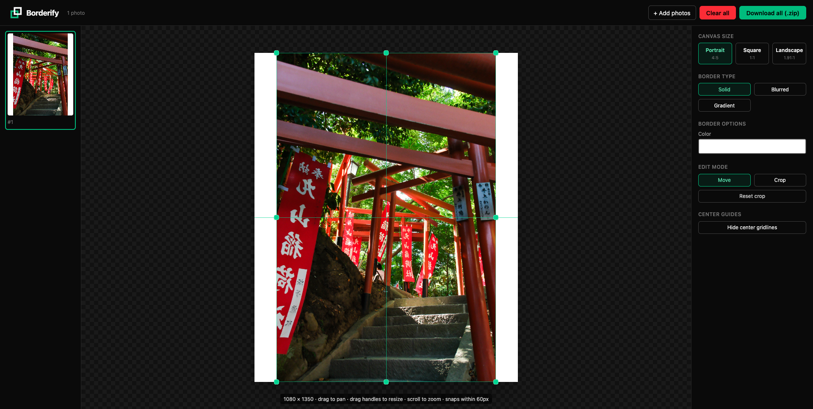
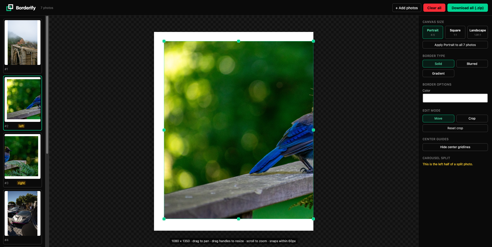
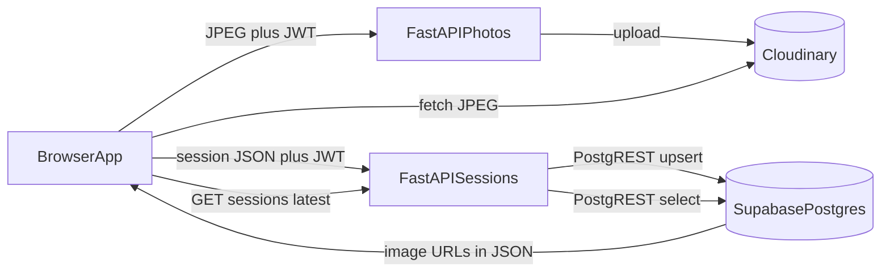

# Borderify 📸

> Frame your photos for Instagram carousels — portrait, landscape, square — without having your images auto-cropped. **Editing runs entirely in your browser**; optional sign-in syncs sessions to the cloud.

---

## The Problem

Instagram's **auto-cropping** is a well-known frustration for photographers. When you upload a carousel post, Instagram forces every subsequent image to match the aspect ratio of the first. So if your first slide is portrait, your landscape shots get cropped horizontally. If your first slide is landscape, your tall portraits get cropped vertically.

Common camera outputs like 3:2, 2:3, panoramic, and mixed-orientation sets don't map cleanly to Instagram's allowed ratios. Borderify solves this by adding **smart borders** to every photo so nothing gets cropped — regardless of orientation or canvas size.

---

## Demo

|  |  |
| --- | --- |

Watch the demo video: [https://youtu.be/XPusJlderWk](https://youtu.be/XPusJlderWk)

---

## Features

### Upload

- Batch upload in **PNG** or **JPG**; drag-and-drop or file picker
- While you are only editing locally, **nothing is sent to any server** — images stay as `ImageBitmap` in the tab

### Auto-frame on import

- Every photo is **export-ready immediately** after import
- [`autoLayout.ts`](frontend/src/lib/autoLayout.ts) picks an initial canvas preset (portrait / square / landscape) from the source aspect ratio and fits the image with balanced borders

### Canvas sizes

Instagram-ready presets (exact pixel dimensions):

| Format | Dimensions | Ratio | Use case |
|--------|------------|-------|----------|
| Portrait | 1080 × 1350 px | 4:5 | Portrait feed posts |
| Landscape | 1080 × 566 px | 1.91:1 | Landscape feed posts |
| Square | 1080 × 1080 px | 1:1 | Standard square posts |

- **Apply to all:** one click sets every photo in the queue to the same preset ([`ControlsPanel.tsx`](frontend/src/components/ControlsPanel.tsx))

### Border styles

Per-photo styling in [`borders.ts`](frontend/src/lib/borders.ts):

- **Solid** — color picker for a flat border
- **Blurred** — the photo (cover-filled, blurred) as the border; blur strength is adjustable
- **Gradient** — two colors and an adjustable angle

### Move mode

- **Pan** by dragging the canvas
- **Zoom** with scroll wheel
- **Aspect-locked resize** via eight handles around the visible image frame

### Crop mode

- **Non-destructive crop:** a movable, resizable crop window over the mapped image; **Reset crop** returns to full frame ([`CanvasStage.tsx`](frontend/src/components/CanvasStage.tsx), clip logic in [`render.ts`](frontend/src/lib/render.ts))
- **Symmetric crop:** a checkbox in crop mode that mirrors the crop rectangle horizontally and vertically simultaneously, keeping the subject centered
- For **split carousel halves**, cropping one half **mirrors** on the other so the seam stays coherent ([`store.ts`](frontend/src/store.ts) — `updateCrop` / `resetCrop`)

### Center snapping and gridlines

- Panning **snaps** when within `SNAP_THRESHOLD` (60px) of true visual center ([`geometry.ts`](frontend/src/lib/geometry.ts))
- **Gridlines** can be toggled on or off at any time from the sidebar via the **Show / Hide gridlines** button

### Carousel split

- **Wide landscape** photos on a portrait or square canvas can be **split into two posts** (left + right halves) for a panoramic carousel scroll ([`autoLayout.ts`](frontend/src/lib/autoLayout.ts) / [`geometry.ts`](frontend/src/lib/geometry.ts))
- **Mirrored transforms:** moving or scaling one half updates the sibling half symmetrically (`updateTransform` in [`store.ts`](frontend/src/store.ts))

### Photo list

- **Drag-and-drop reorder** thumbnails in the left sidebar
- **Add photos** while editing by clicking the "Click to Add" button at the bottom of the photo list, or by dragging image files directly onto the sidebar panel ([`PhotoList.tsx`](frontend/src/components/PhotoList.tsx))
- **Remove** individual photos with the × button on each thumbnail; **Clear all** from the editor header

### Optional cloud session save

- **Sign up / log in** with Supabase (email + password)
- When signed in, **Save** uploads compressed JPEGs via the backend to **Cloudinary** and persists session JSON (including image URLs and edit state) in **Supabase**; visiting `/app` again **restores** the last session ([`AppPage.tsx`](frontend/src/pages/AppPage.tsx), [`ExportBar.tsx`](frontend/src/components/ExportBar.tsx))
- **No account:** full editor and **export** still work offline in the browser

### Export

- **Download all** as a single `.zip` of numbered **JPEG** files at quality `1.0` ([`export.ts`](frontend/src/lib/export.ts) + JSZip)
- Export uses the same render path as the on-screen preview so **WYSIWYG**

---

## Tech stack

### Frontend

| Concern | Technology |
|---------|------------|
| UI | React 18 |
| Tooling | Vite 5, TypeScript 5 |
| Styling | Tailwind CSS v4 (`@tailwindcss/vite`) |
| Routing | React Router v7 |
| State | Zustand |
| Canvas | HTML5 Canvas API |
| Batch download | JSZip |
| Auth client | `@supabase/supabase-js` |

### Backend

| Concern | Technology |
|---------|------------|
| API | FastAPI |
| Config | Pydantic Settings |
| HTTP client | httpx (Supabase PostgREST) |
| JWT verification | python-jose (JWKS / RS256 vs Supabase issuer) |
| Media upload API | Cloudinary Python SDK |
| Multipart uploads | python-multipart |
| Server | uvicorn |

### Cloud and infra

| Concern | Technology |
|---------|------------|
| Auth | Supabase Auth (JWT for `Authorization: Bearer`) |
| Session metadata | Supabase Postgres via PostgREST (`session` table upsert / fetch) |
| Saved image files | Cloudinary (per-user folder; see `CLOUDINARY_FOLDER` in config) |
| Hosting | Vercel — [`vercel.json`](vercel.json) `experimentalServices`: Vite frontend at `/`, FastAPI at `/api` |

---

## Architecture

Editing and export are **local-first**. The FastAPI backend is used when a signed-in user **saves** a session or when `/app` **loads** to fetch the latest saved session.



---

## Project structure

```
borderify/
├── README.md
├── vercel.json                     # Vercel mono-config: frontend at /, backend at /api
├── frontend/
│   ├── index.html
│   ├── vite.config.ts
│   ├── package.json
│   ├── public/                     # logo + landing imagery
│   └── src/
│       ├── main.tsx                # React entry
│       ├── App.tsx                 # Router + Supabase auth listener
│       ├── styles.css
│       ├── store.ts                # Zustand: photos, transforms, split mirror, session restore
│       ├── types.ts
│       ├── pages/
│       │   ├── LandingPage.tsx
│       │   ├── AppPage.tsx         # Editor entry — GET /photos/sessions/latest on mount
│       │   ├── LoginPage.tsx
│       │   └── SignupPage.tsx
│       ├── components/
│       │   ├── UploadScreen.tsx
│       │   ├── EditorScreen.tsx
│       │   ├── ExportBar.tsx       # Save / export zip / add photos / clear
│       │   ├── PhotoList.tsx       # Drag-reorder + delete
│       │   ├── CanvasStage.tsx     # Move + crop modes, handles, snapping
│       │   ├── ControlsPanel.tsx   # Preset, border, edit mode, split
│       │   └── BorderControls.tsx
│       └── lib/
│           ├── supabase.ts
│           ├── presets.ts
│           ├── autoLayout.ts
│           ├── geometry.ts         # fit, snap, clamp, split slicing
│           ├── borders.ts
│           ├── render.ts           # single source of truth for canvas + export
│           └── export.ts           # JPEG + JSZip
└── backend/
    ├── requirements.txt
    ├── main.py                     # `from app.main import app` (Vercel / local shim)
    ├── .env.example
    └── app/
        ├── main.py                 # FastAPI app + CORS + routers
        ├── core/
        │   ├── config.py           # Pydantic settings from env
        │   └── auth.py             # Supabase JWT via JWKS cache
        └── api/routes/
            ├── system.py           # GET /health, GET /me
            ├── projects.py         # placeholder project CRUD
            └── photos.py           # upload, sessions, reset-folder
```

---

## Getting started

### Prerequisites

- **Frontend:** Node.js 18+ and npm
- **Backend (optional):** Python 3.11+, a Supabase project, a Cloudinary account

### 1. Clone

```bash
git clone https://github.com/cuzethan/borderify.git
cd borderify
```

### 2. Run the frontend

The editor, framing, crop/move tools, and zip export work **without** the backend or an account.
The backend is optional, but the current frontend still initializes Supabase auth/session on app load, so you should provide Supabase env vars in `frontend/.env`.

```bash
cd frontend
npm install
npm run dev
```

Open **http://localhost:5173**.

Create **`frontend/.env`** (required by current app boot/auth checks; values from your Supabase project → Settings → API):

```bash
VITE_SUPABASE_URL=https://<your-project-ref>.supabase.co
VITE_SUPABASE_ANON_KEY=<anon or publishable key>
# Base URL for Save + session restore (omit or use /api on Vercel)
VITE_API_BASE_URL=http://localhost:8000
```

The **Save** button appears only when you are signed in; it calls `VITE_API_BASE_URL`.

### 3. (Optional) Backend for cloud Save / Restore

Needed for **Save** and automatic **session restore** on `/app`. You need:

1. A **`session`** table in Supabase, for example: `user_id` (text, primary key), `photos` (jsonb), `created_at` (timestamptz, default `now()`).
2. Cloudinary credentials.

```bash
cd backend
python -m venv .venv
source .venv/bin/activate   # Windows: .venv\Scripts\activate
pip install -r requirements.txt
cp .env.example .env
# Edit .env with real values, then:
uvicorn app.main:app --reload --port 8000
```

**`backend/.env`** (see [`backend/app/core/config.py`](backend/app/core/config.py)):

```bash
SUPABASE_URL=https://<your-project-ref>.supabase.co
SUPABASE_JWT_AUDIENCE=authenticated
SUPABASE_JWKS_TTL_SECONDS=3600
SUPABASE_SERVICE_ROLE_KEY=<service_role key>
CLOUDINARY_CLOUD_NAME=<cloud name>
CLOUDINARY_API_KEY=<api key>
CLOUDINARY_API_SECRET=<api secret>
CLOUDINARY_FOLDER=borderify
```

Health check:

```bash
curl http://localhost:8000/health
# {"status":"ok"}
```

---

## How it works

1. **Upload:** files are decoded to **`ImageBitmap`** in the browser. No server round-trip for editing.
2. **Auto-frame:** [`autoLayout.ts`](frontend/src/lib/autoLayout.ts) assigns a default preset and fit so each photo is ready to export with borders that avoid cropping the full image.
3. **Edit:** border type and parameters update per photo; [`render.ts`](frontend/src/lib/render.ts) redraws the canvas on every change.
4. **Crop mode:** the visible image is a **clipped window** over the scaled placement (`clip` rect in `render.ts`). Split halves keep mirrored crops via [`store.ts`](frontend/src/store.ts).
5. **Split mode:** eligible landscape images become two entries sharing one bitmap; [`geometry.ts`](frontend/src/lib/geometry.ts) slices left/right source rects for each canvas.
6. **Session saving (logged in):** the client prepares **JPEG blobs** (rescale / recompress to stay under ~10MB), **`POST /photos/upload`** for each with the Supabase **JWT** → Cloudinary returns URLs; then **`POST /photos/sessions`** upserts JSON (presets, borders, transforms, crop, split metadata, `imageUrl`, etc.) into Supabase via PostgREST. On return, **`GET /photos/sessions/latest`** loads that row and [`AppPage.tsx`](frontend/src/pages/AppPage.tsx) refetches images from Cloudinary into `ImageBitmap` again.
7. **Export:** each photo is rendered off-screen with the same pipeline, then **`canvas.toBlob('image/jpeg', 1.0)`**; all files are zipped with JSZip.

---

## Authors

- Brendan Ly
- Ethan Le
- Jason Nguyen

Built at **SJHacks 2026**.
